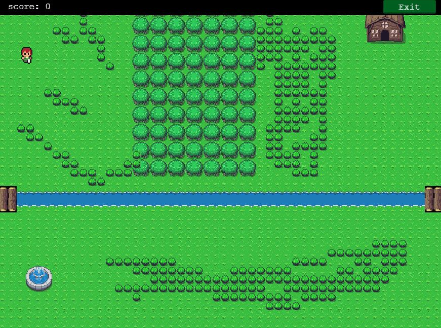

# RPG-game

> This is the JavaScript capstone project in microverse, the project is a  game built using the Phaser 3 Framework and javascript

## Built With

- JavaScript
- Phaser 3
- Webpack
- Lots of love :heart:

## Game Instructions

-Click on play button to start the game.

-Move your player using the arrow keys on your keyboard.

-In the battle, use arrow keys to choose and space bar or left arrow to confirm your characters attack and try to defeat the enemies.

-Enjoy the game and explore the options

## Game design

The game is a turn-based role-playing game(RPG).
In the game there are two main characters: A warrior and A mage, they travel the whole world and fight dragons as they keep travelling. The player uses keyboard arrows up, down, left, right. 
In the battle scene, use keyboard arrows up, down, left, and space bar to attack the chosen enemy.
Inside the battle, the scene player can see his characters' and enemies' health bars at all times. Also there are player's score available to see in the top bar in both of the scenes, when player want to quit, he can use the button 'Exit' in the top right of the bar, after clicking said button player is taken to High Score scene, where all top players and their scores are listed.

## Getting started

Open the terminal

`git clone git@github.com:Shaher-11/RPG-game.git`

`npm install`

`npm run start`

Visit the port `127.0.0.1:8080`

## Testing

Run tests with the following command:

`npm test`

## Live Demo

[View Live](https://keen-lamarr-8a69c0.netlify.app/)

👤 **Shaher Shamroukh**
 
[<code></code>](https://github.com/Shaher-11)
[<code></code>](https://twitter.com/ShaherShamroukh/)
[<code></code>](https://www.linkedin.com/in/shaher-shamroukh/)
 
 

## 🤝 Contributing

Contributions, issues, and feature requests are welcome!

Feel free to check the [issues page](https://github.com/Shaher-11/udzilla/issues).

## Show your support

Give a ⭐️ if you like this project!

## 📝 License

This project is [MIT](../LICENSE) licensed.
